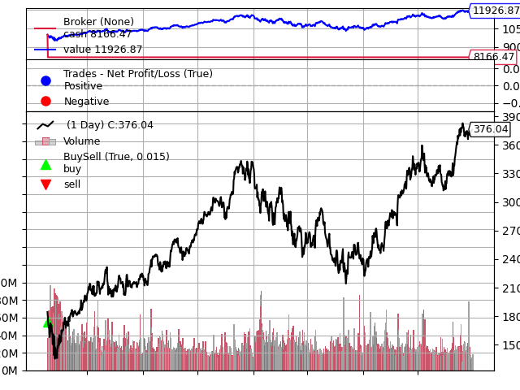

# 基于因子挖掘的股票交易策略



本项目实现了一个基于机器学习和因子挖掘的股票交易策略，展示了从数据获取到策略回测的完整流程。

## 项目特点

- 数据获取与预处理
- 基于技术指标的特征工程
- 时间序列特征提取和因子挖掘
- 机器学习模型训练（支持向量机SVM和随机森林）
- 策略回测

## 环境要求

- Python 3.8+
- 所需库列于 `requirements.txt` 文件中

## 安装步骤

1. 克隆此仓库:
```
   git clone https://github.com/yourusername/Factor-Mining-based-Stock-Trading-Strategy.git
   cd Factor-Mining-based-Stock-Trading-Strategy
```

2. 安装所需包:
   ```
   pip install -r requirements.txt
   ```

3. 在Linux平台安装TA-Lib:
   ```python
   url = 'https://launchpad.net/~mario-mariomedina/+archive/ubuntu/talib/+files'
   ext = '0.4.0-oneiric1_amd64.deb -qO'
   !wget $url/libta-lib0_$ext libta.deb
   !wget $url/ta-lib0-dev_$ext ta.deb
   !dpkg -i libta.deb ta.deb
   !pip install ta-lib
   ```

## 数据集

本项目使用的数据集可以从以下任一位置下载:
- [Kaggle](https://www.kaggle.com/datasets/stevenchen116/stockchina?select=original_data)
- [Hugging Face](https://huggingface.co/datasets/StevenChen16/Stock-China-daily)

这两个链接包含相同的数据集。

## 使用方法

1. 下载数据集并将其放置在 `data` 目录中。
2. 运行Jupyter notebook `stock_trading_strategy.ipynb` 以执行整个策略开发流程。

## 许可证

本项目采用Apache License 2.0许可证。详情请见 [LICENSE](LICENSE) 文件。

版权所有 2024 Steven Chen

根据Apache License 2.0 （"许可证"）获得许可；
除非遵守许可证，否则您不得使用此文件。
您可以在以下位置获取许可证副本：

    http://www.apache.org/licenses/LICENSE-2.0

除非适用法律要求或书面同意，否则根据许可证分发的软件是基于"按原样"分发的，
不附带任何明示或暗示的保证或条件。
有关许可证下的特定语言管理权限和限制，请参阅许可证。

## 致谢

- [TA-Lib](https://ta-lib.org/) 提供技术分析函数
- [tsfresh](https://tsfresh.readthedocs.io/) 用于时间序列特征提取
- [scikit-learn](https://scikit-learn.org/) 提供机器学习工具

## 联系方式

如有任何疑问，请在本仓库中开启一个issue。