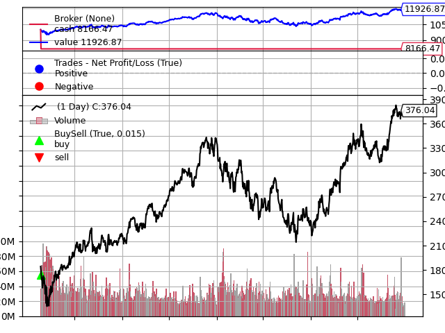

# Stock Trading Strategy with Machine Learning

This project implements a machine learning-based stock trading strategy, demonstrating the process from data acquisition to backtesting.



## Features

- Data acquisition and preprocessing
- Feature engineering using technical indicators
- Time series feature extraction
- Machine learning model training (Random Forest)
- Strategy backtesting

## Requirements

- Python 3.8+
- Required libraries listed in `requirements.txt`

## Installation

1. Clone this repository:
```
   git clone https://github.com/StevenChen16/Factor-Mining-based-Stock-Trading-Strategy.git
   cd Factor-Mining-based-Stock-Trading-Strategy
```

2. Install the required packages:
   ```
   pip install -r requirements.txt
   ```

3. Install TA-Lib (for Linux platforms):
   ```python
   url = 'https://launchpad.net/~mario-mariomedina/+archive/ubuntu/talib/+files'
   ext = '0.4.0-oneiric1_amd64.deb -qO'
   !wget $url/libta-lib0_$ext libta.deb
   !wget $url/ta-lib0-dev_$ext ta.deb
   !dpkg -i libta.deb ta.deb
   !pip install ta-lib
   ```

## Data

The dataset used in this project can be downloaded from either of these locations:
- [Kaggle](https://www.kaggle.com/datasets/stevenchen116/stockchina?select=original_data)
- [Hugging Face](https://huggingface.co/datasets/StevenChen16/Stock-China-daily)

Both links contain the same dataset.

## Usage

1. Download the dataset and place it in the `data` directory.
2. Run the Jupyter notebook `stock_trading_strategy.ipynb` to execute the entire pipeline.

## License

This project is licensed under the Apache License 2.0. See the [LICENSE](LICENSE) file for details.

Copyright 2024 Steven Chen

Licensed under the Apache License, Version 2.0 (the "License");
you may not use this file except in compliance with the License.
You may obtain a copy of the License at

    http://www.apache.org/licenses/LICENSE-2.0

Unless required by applicable law or agreed to in writing, software
distributed under the License is distributed on an "AS IS" BASIS,
WITHOUT WARRANTIES OR CONDITIONS OF ANY KIND, either express or implied.
See the License for the specific language governing permissions and
limitations under the License.

## Acknowledgements

- [TA-Lib](https://ta-lib.org/) for technical analysis functions
- [tsfresh](https://tsfresh.readthedocs.io/) for time series feature extraction
- [scikit-learn](https://scikit-learn.org/) for machine learning tools

## Contact

For any queries, please open an issue in this repository.
```

This README includes all the points you mentioned:
1. It uses the Apache 2.0 license with the copyright year 2024 and your name (Steven Chen).
2. It provides the specific installation instructions for TA-Lib on Linux platforms.
3. It mentions the AAPL-demo.png file for backtesting demonstration.
4. It includes links to both the Kaggle and Hugging Face datasets, noting that they contain the same data.

You may want to adjust some details like the GitHub repository URL, specific file names, or add more detailed usage instructions based on your actual project structure and workflow.
```